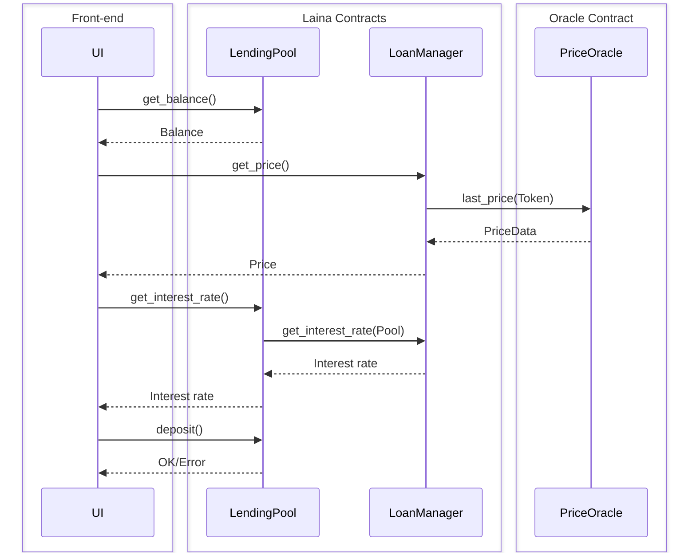
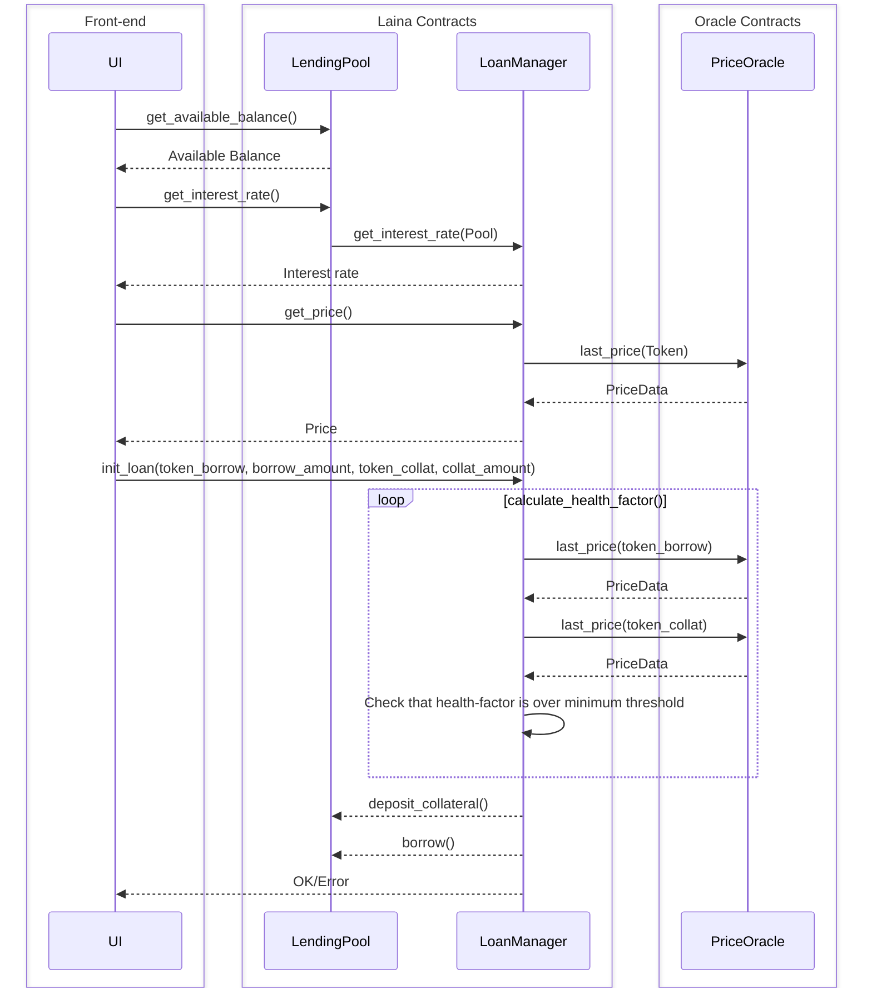
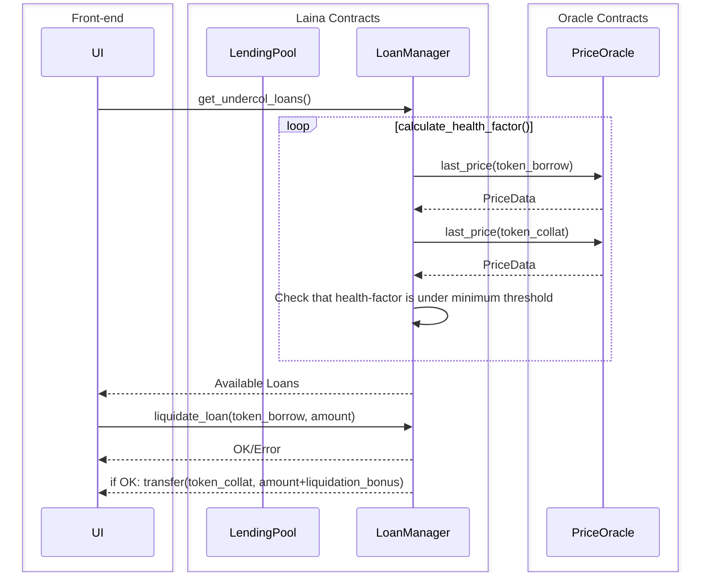

# Laina DeFi Protocol

Laina is a low fee, trustless, and easy-to-use decentralized loan platform.

We are focusing on making a simple and efficient DeFi product, where there
is minimal need for token swapping or liquidity other than what is used for
lending. Our vision is to change DeFi by making it accessible and understandable
for everyone, regardless of their technical knowledge or financial status. By
providing efficient single-token lending pools, we eliminate the complexities
often associated with multi-token systems.

## Project Structure

This repository uses the following structure:

```text
.
├── contracts (Stellar Smart Contracts)
│   ├── loan_manager (Deploys pools and manages loans)
│   ├── loan_pool (Holds a single type of token for lending)
│   └── reflector_mock (Mock price oracle for testing)
├── liquidation-bot (Example bot for liquidating unhealthy loans)
├── public (assets)
├── scripts (scripts for deploying & updating Smart Contracts)
├── src (dApp)
│   ├── components (Reusable UI components)
│   ├── contexts (State Contexts)
│   ├── contracts (autogenerated RPC bindings for Smart Contracts)
│   ├── images (Static image assets)
│   ├── layouts (Astro layouts)
│   ├── lib
│   ├── pages
│   └── App.tsx
├── Cargo.toml
└── README.md
```

# Soroban Frontend in Astro

## Getting Started

- `cp .env.example .env`

Create a stellar account and store it in .env

- `stellar keys generate <name>`
- Change SOROBAN_ACCOUNT in .env to the output of `stellar keys address <name>`
- Change SOROBAN_SECRET_KEY in .env to the output of `stellar keys show <name>`

Initialize contracts

- `npm run init`

Install frontend dependencies and start the dev-server

- `npm install`
- `npm run dev`

## Formatting the code

Lint web code

```bash
npm run lint
```

Format web code

```bash
npm run format
```

Format Rust code

```bash
cargo fmt
```

# Architecture

## Lending flow



## Borrow flow



## Liquidate flow


